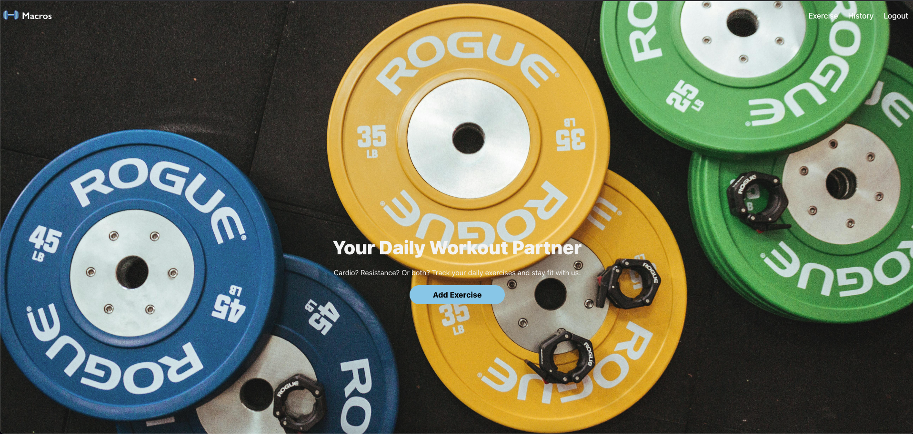
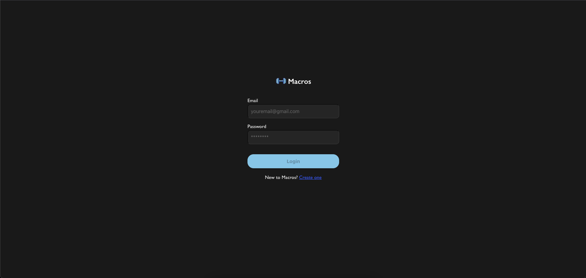
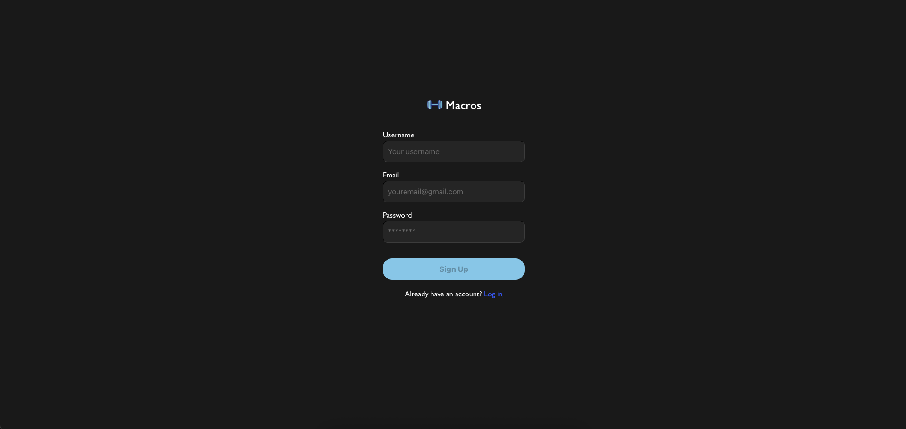
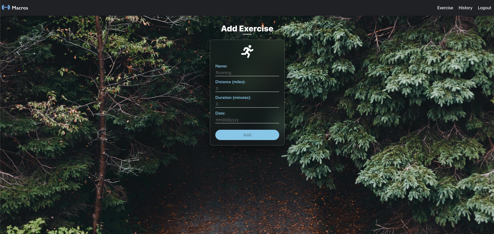
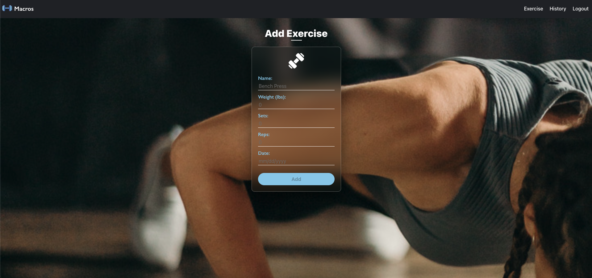
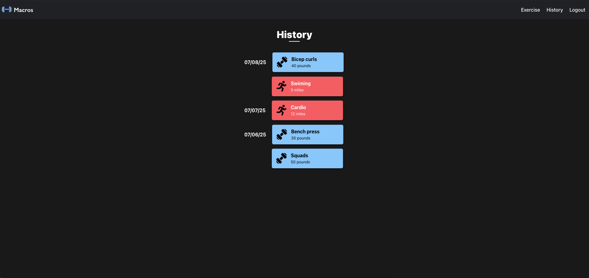
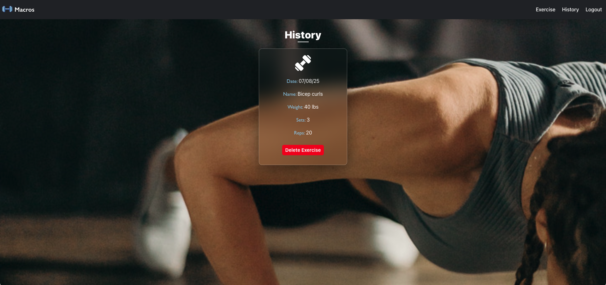
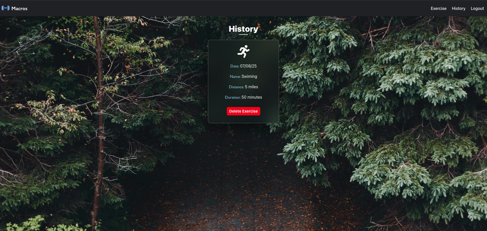

# Macros

A MERN-stack fitness tracker app.

## Table of Contents

- [Macros](#macros)
  - [Table of Contents](#table-of-contents)
  - [Description:](#description)
  - [Technology:](#technology)
  - [Installation](#installation)
  - [Usage](#usage)
  - [Deployment](#deployment)
    - [1. Database Setup (MongoDB Atlas)](#1-database-setup-mongodb-atlas)
    - [2. Deploy to Render](#2-deploy-to-render)
      - [Example Screenshot](#example-screenshot)

## Description:

A user-friendly MERN-stack application that enables individuals to easily track and manage their daily fitness routines. Features include logging and tracking of both cardio and resistance exercises, viewing of workout history, and ability to delete exercises.

## Technology:

Project is created with:

- Mongoose
- Express.js
- React.js
- Node.js
- JWT Authentication

## Installation

To run this project, install it locally using npm:

```
npm install
```

## Usage

After installing npm packages, the application will be invoked by using the following command:

```
npm run develop
```

## Deployment

This app is ready for deployment on Render. Follow these steps:

### 1. Database Setup (MongoDB Atlas)
1. **Create a free account** at [MongoDB Atlas](https://cloud.mongodb.com)
2. **Create a new cluster**:
   - Choose the FREE tier (M0 Sandbox)
   - Select a cloud provider and region
   - Name your cluster (e.g., "MacrosCluster")
3. **Set up database access**:
   - Go to "Database Access" → "Add New Database User"
   - Create username and password (save these!)
   - Set role to "Read and write to any database"
4. **Configure network access**:
   - Go to "Network Access" → "Add IP Address"
   - Choose "Allow access from anywhere" for now
5. **Get your connection string**:
   - Click "Connect" on your cluster → "Connect your application"
   - Copy the connection string
   - Replace `<password>` with your database user password
   - Replace `myFirstDatabase` with `macros-fitness`

### 2. Deploy to Render
1. Push your code to GitHub
2. Connect your GitHub repo to [Render](https://render.com)
3. Create a new Web Service
4. Set these environment variables in Render:
   - `MONGODB_URI`: Your MongoDB Atlas connection string
   - `NODE_ENV`: `production`
   - `JWT_SECRET`: A secure random string
5. Render will automatically detect and deploy your app!

[Click me to see the deployed app!](https://your-app-name.onrender.com)

#### Example Screenshot

- Home Page <br>
  

- Login Page <br>
  

- Exercise Page <br>
  

- Add Cardio <br>
  

- Add Resistance <br>
  

- History Page <br>
  

- Single Resistance History <br>
  

- Single Cardio History <br>
  
